# Save AI Outputs To Nuclino (N8N Workflow)

[](https://n8n.io/) 

An N8N workflow that automatically processes voice notes from Voicenotes.com, sends them to AI for processing, creates documentation in Nuclino, and sends notifications via Slack.

## 🚀 Features

- **Voice Note Processing**: Automatically receives voice notes via webhook
- **AI Integration**: Uses OpenRouter API with Claude Sonnet for intelligent responses
- **Documentation**: Creates structured notes in Nuclino with markdown formatting
- **Notifications**: Sends formatted updates to Slack channels
- **Archiving**: Stores prompts and outputs in NocoDB for record keeping
- **Structured Output**: Enforces consistent markdown format with Summary, Prompt, and Response sections

## 📋 Prerequisites

- [N8N](https://n8n.io/) instance (self-hosted or cloud)
- [Nuclino](https://www.nuclino.com/) account and API access
- [OpenRouter](https://openrouter.ai/) API key
- [Slack](https://slack.com/) workspace with bot permissions
- [Voicenotes.com](https://voicenotes.com/) account (optional - for voice input)
- [NocoDB](https://nocodb.com/) instance (optional - for archiving)

## 🔧 Setup Instructions

### 1. Import the Workflow

1. Download the workflow file from the `/workflow` directory
2. In N8N, go to **Workflows** → **Import from File**
3. Select the downloaded JSON file

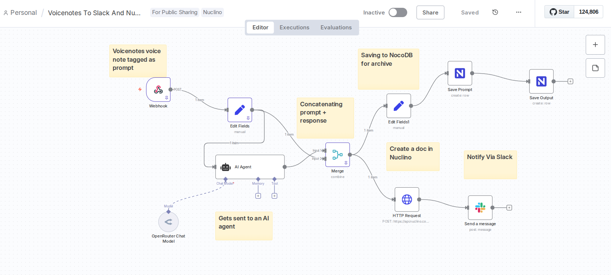

### 2. Configure Nuclino Integration

Since there's no official Nuclino integration in N8N yet, you'll need to set it up as a custom HTTP header authentication:

#### Step 1: Create HTTP Header Auth Credential

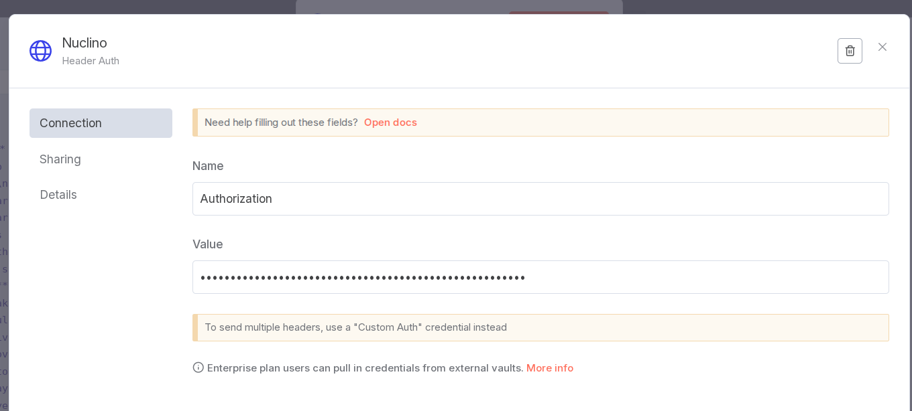

#### Step 2: Configure the Header

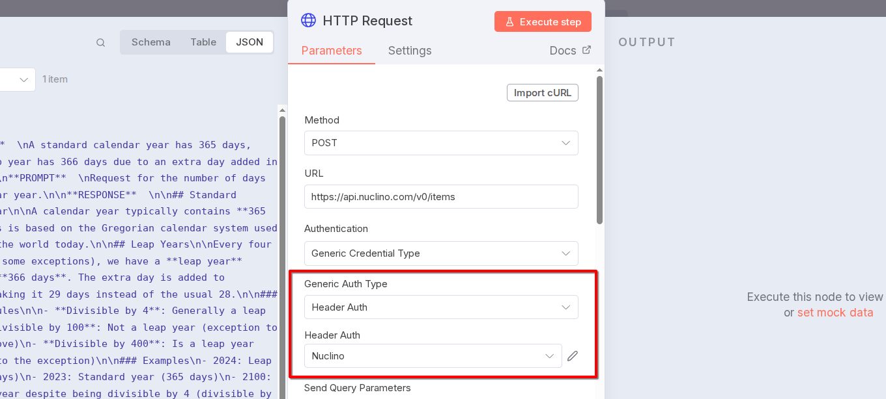

- **Header Name**: `Authorization`
- **Header Value**: `Bearer YOUR_NUCLINO_API_TOKEN`

#### Step 3: Get Your Nuclino API Token

1. Go to [Nuclino API Settings](https://www.nuclino.com/api)
2. Generate a new API token
3. Copy the token and use it in the credential setup

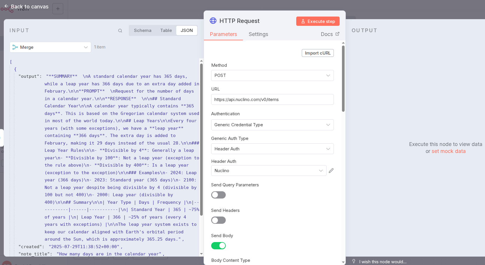
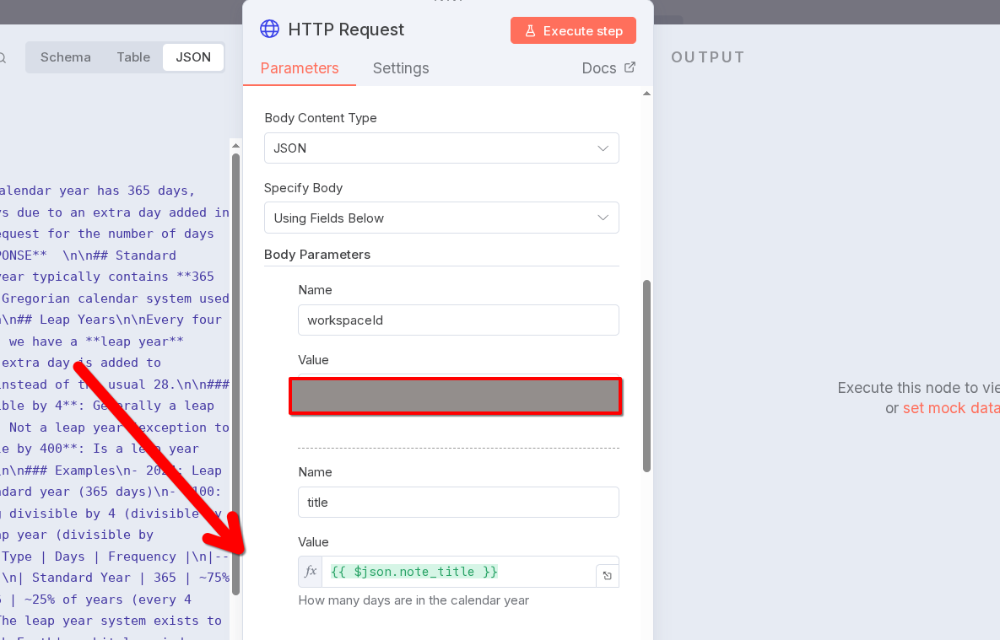
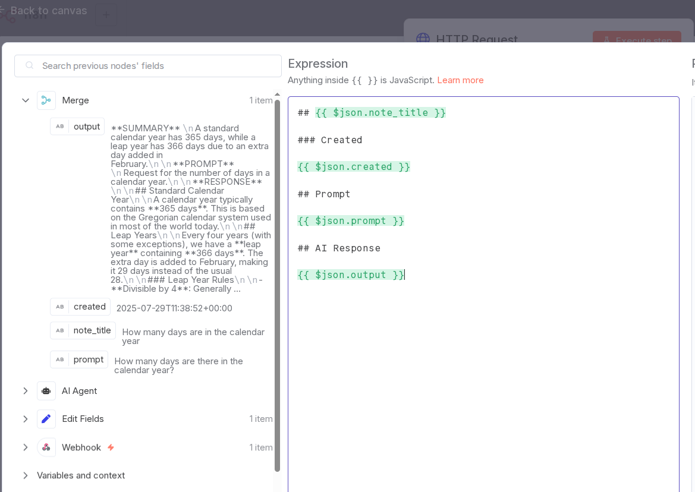
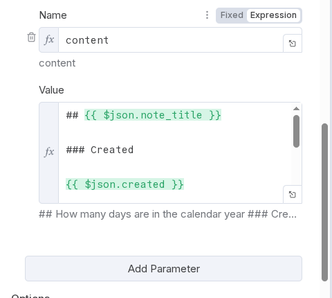

### 3. Configure Other Integrations

#### OpenRouter API
- Create an OpenRouter credential in N8N
- Add your OpenRouter API key

#### Slack Integration
- Set up Slack OAuth2 credential
- Configure bot permissions for posting messages
- Get your channel ID for notifications

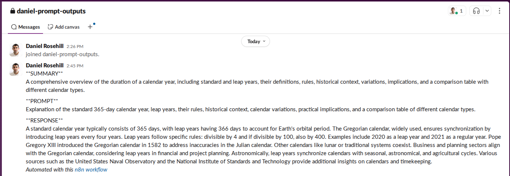

#### NocoDB (Optional)
- Set up NocoDB API token credential
- Configure project and table IDs for archiving

### 4. Workflow Configuration

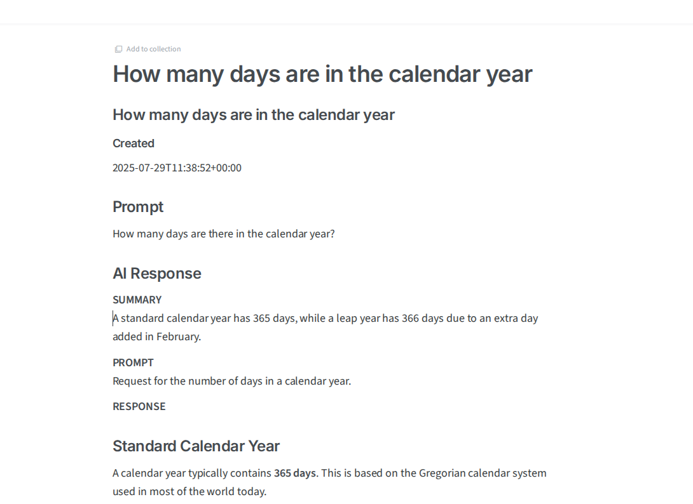
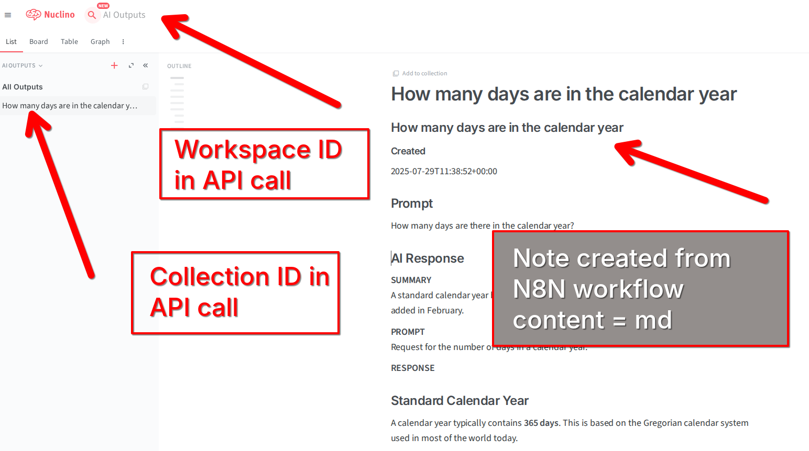

Update the following parameters in the workflow:

- **Webhook URL**: Configure your webhook endpoint
- **Nuclino Workspace ID**: Your Nuclino workspace identifier
- **Nuclino Collection ID**: Target collection for new documents
- **Slack Channel ID**: Channel for notifications
- **AI Model**: Configure your preferred model (default: Claude Sonnet)

## 📖 How It Works

1. **Webhook Trigger**: Receives voice note data from Voicenotes.com
2. **Data Processing**: Extracts title and transcript from the webhook payload
3. **AI Processing**: Sends the transcript to OpenRouter API for intelligent response
4. **Document Creation**: Creates a structured note in Nuclino with:
   - Title from voice note
   - Original prompt
   - AI-generated response
   - Timestamp
5. **Notification**: Sends formatted message to Slack with note URL
6. **Archiving**: Stores data in NocoDB for future reference

## 🎯 Output Format

The AI agent is configured to provide structured responses in this format:

```markdown
**SUMMARY**  
{One-line summary of the response}

**PROMPT**  
{Summary of the original request}

**RESPONSE**  
{Detailed, structured answer with headings, bullet points, and tables}
```

## 🔗 Related Resources

- **[Nuclino API Documentation (Unofficial)](https://github.com/danielrosehill/Nuclino-API-Docs-Unofficial-0725)** - Comprehensive API documentation
- **[Nuclino Official Website](https://www.nuclino.com/)** - Team knowledge base platform
- **[Nuclino API](https://www.nuclino.com/api)** - Official API documentation
- **[N8N Creator Profile](https://n8n.io/creators/danielrosehill/)** - More N8N workflows and templates

## 🛠️ Customization

### Modifying AI Behavior
Edit the system message in the AI Agent node to change response format or behavior.

### Adding More Integrations
The workflow can be extended to include:
- Additional notification channels
- Different AI providers
- More archiving options
- Custom data processing steps

### Webhook Sources
While designed for Voicenotes.com, the webhook can accept data from any source that provides:
- `title` field
- `transcript` or `content` field
- `timestamp` field

---

## 📝 Worked Example

Here's a complete walkthrough of the workflow in action:

### Step 1: Create a Voice Note in Voicenotes.com

Start by creating a voice note in Voicenotes.com with your question or prompt:

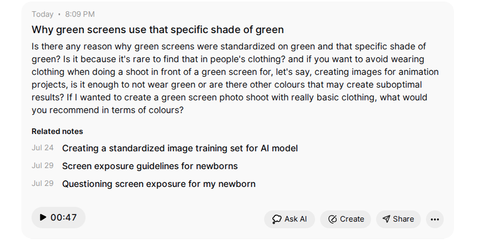

### Step 2: Workflow Processes the Voice Note

Once the voice note is created, Voicenotes.com sends a webhook to your N8N workflow. The workflow extracts the transcript and processes it through the AI agent:

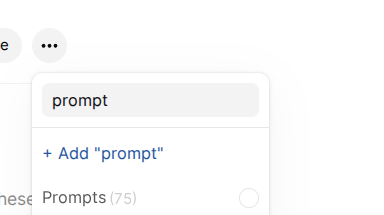

### Step 3: AI Generates Structured Response

The AI agent (powered by Claude Sonnet via OpenRouter) generates a structured response following the predefined format with Summary, Prompt, and Response sections:

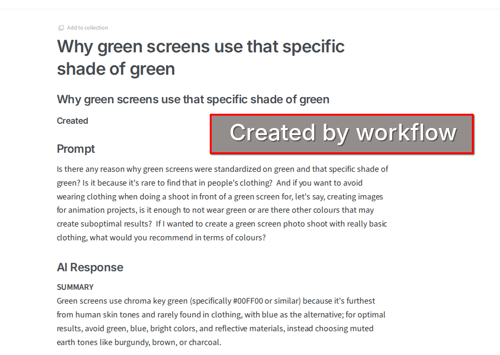

### Step 4: Documentation Created and Notifications Sent

The workflow creates a structured document in Nuclino and sends a notification to your Slack channel with the complete interaction:

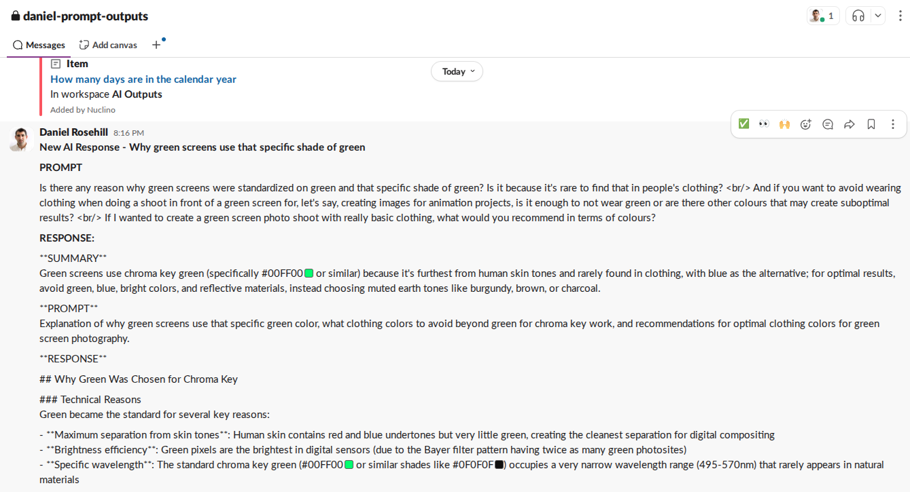

### What Happens Behind the Scenes:

1. **Voice Note Webhook**: Voicenotes.com sends POST request with transcript data
2. **Data Extraction**: N8N extracts title and transcript from the webhook payload
3. **AI Processing**: Claude Sonnet processes the prompt and generates structured response
4. **Document Creation**: Nuclino document created with formatted content
5. **Team Notification**: Slack message sent with prompt, response, and document link
6. **Archiving**: Both prompt and response stored in NocoDB for future reference

This entire process typically takes 15-30 seconds from voice note creation to final notification.

 